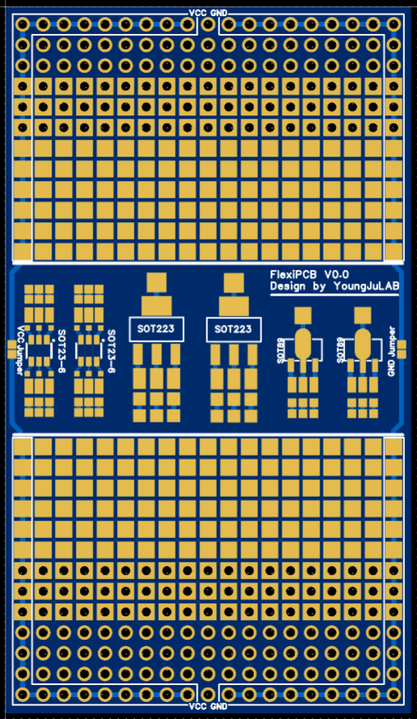
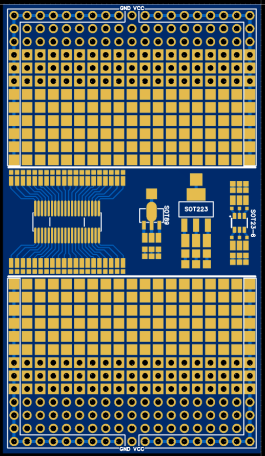

# FlexiPCB

## Overview
**FlexiPCB** is a versatile prototyping PCB designed for testing both SMD and through-hole components.  
It includes dedicated pads for common package types such as SOT-23, SOT-89-3, SOT-223, and double-side-pin variable ICs.  
The board also features 2x2mm square single-sided pads and through-hole pads, enabling easy experimentation with various component types.

## Specifications
- **Board Size:** 50 × 86.9 mm  
- **Layers:** 2-layer (double-sided)  
- **Copper Thickness:** 1 oz  
- **Pad Types:**
  - 2x2mm square single-side pads (for SMD parts)
  - Through-hole pads (for leaded components)
- **Supported Packages:**
  - SOT-23
  - SOT-89-3
  - SOT-223
  - Double-side-pin variable ICs
- **Power Rails:**
  - VCC and GND lines for easy connection

## PCB Preview
**Top View**  

**Bottom View**  

## Applications
- Rapid prototyping of mixed SMD and through-hole circuits
- Component footprint testing
- Educational projects and training boards
- Small production runs

## Files
- `FlexiPCB_Gerber.zip` – Manufacturing files
- `top.png` – Top side PCB preview
- `bottom.png` – Bottom side PCB preview

## License
This project is released under the MIT License.